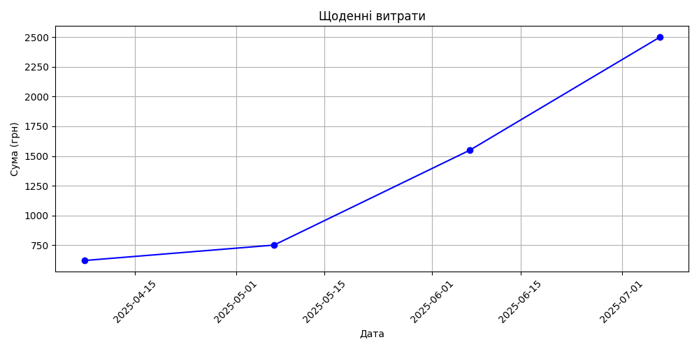
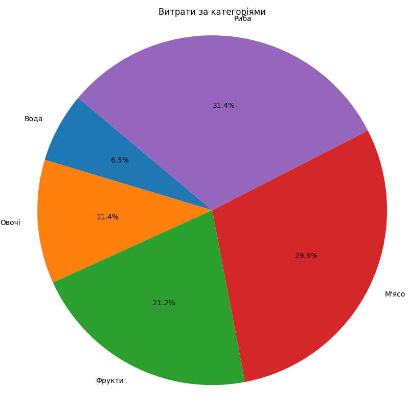

# Expense Tracker (expenses)

This project is a simple Python-based expense tracker. It allows users to:

- Enter expenses in the format: `item amount` (e.g., `bread 30`)
- Automatically record the date and time of each entry
- Store all expenses in a CSV file (`expenses.csv`)
- Analyze total expenses by day or by category
- Visualize data using graphs and pie charts
- Filter expenses for a specific date range

## 🧾 How it works

1. Run `expenses.py` to add new expenses.  
2. Enter each expense in the format:
item amount  
For example:
вода 100
овочі 50

👉 Press Enter after each line.  
Type `stop` to finish entry.

2. Run `analyze_expenses.py` to get:
- Summary by category
- Summary by day

3. Run `visualize_expenses.py` to generate:
- A line chart showing daily totals
- A pie chart showing expenses by category

## 📊 Examples

### Daily Expenses Chart



### Expenses by Category



## 📁 File Structure

```
expenses/
├── expenses.py              # Input interface
├── analyze_expenses.py      # Summary analysis
├── visualize_expenses.py    # Chart visualization
├── images/
│   ├── Figure_1.png
│   └── Figure_2.png
└── expenses.csv             # Stored data (in .gitignore)
```


## ⚠️ Note

- `expenses.csv` is excluded from Git tracking using `.gitignore`.
- All dates are automatically generated at the time of entry.
- This tool is useful for individuals and entrepreneurs (e.g., those paying simplified tax rates) who want to track income/expenses accurately.

## 📅 Date Filter Support

`analyze_expenses.py` allows filtering data by start and end dates in format `YYYY-MM-DD`.


